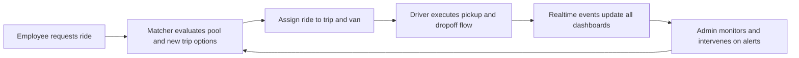
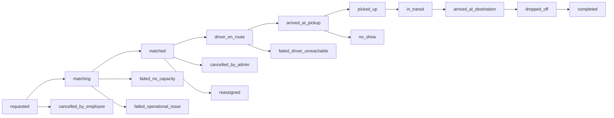
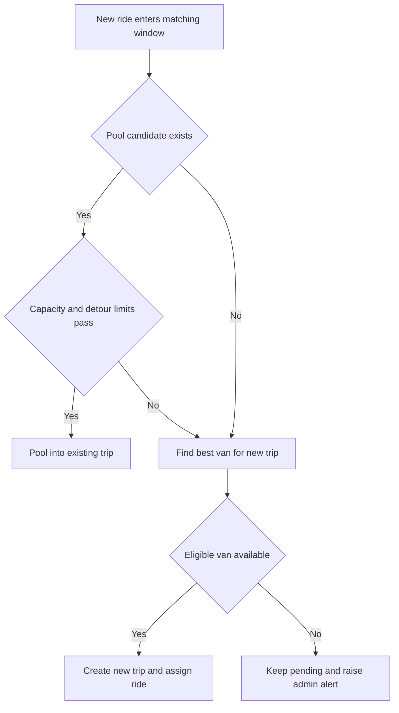

# Van Pooling Platform

Demand-responsive corporate commute platform for three connected roles: employees, drivers, and fleet admins.

This project is not a consumer taxi app. It is a B2B mobility operations system for companies that want reliable employee transport with live visibility and pooled utilization.

## What We Are Building

The platform unifies:

- Employee ride demand (instant + scheduled)
- Driver execution workflow (accept trip, pickup, dropoff, complete)
- Admin operations control (fleet, trips, alerts, users)
- Realtime live updates and map views
- AI copilots that explain state and recommend actions (advisory only)

## Flow Charts

### 1. End-to-End Platform Loop



### 2. Ride Lifecycle State Flow



### 3. Matching Decision Flow



## Personas (Who This Product Serves)

### 1. Employee Persona - "Daily Commuter"

- **Who**: Corporate employee commuting between home, office, or approved hubs.
- **Goal**: Get to destination on time with minimal friction and uncertainty.
- **Pain points**:
  - Fixed shuttle timings do not match real daily schedules.
  - No clear ETA or confidence on pickup timing.
  - Repetitive manual booking for common routes.
- **Needs from platform**:
  - Quick booking (immediate or scheduled)
  - Live van location and ride status
  - Clear cancellation and notification flow

### 2. Driver Persona - "Route Executor"

- **Who**: Assigned fleet driver responsible for safe, timely pickups/dropoffs.
- **Goal**: Execute assigned route cleanly with minimal operational confusion.
- **Pain points**:
  - Unclear stop sequence during dynamic pooling.
  - Manual coordination with ops when demand changes.
  - GPS sharing issues causing dispatch confusion.
- **Needs from platform**:
  - Single active trip board
  - Next-stop clarity with one-tap lifecycle actions
  - Reliable live location publishing and exception reporting

### 3. Admin Persona - "Fleet Operations Manager" (Primary Persona)

- **Who**: Ops lead managing demand, fleet readiness, exceptions, and SLA performance.
- **Goal**: Keep service reliable while maximizing van utilization and reducing idle capacity.
- **Pain points**:
  - Hard to detect demand-supply imbalance early.
  - Delayed visibility into stale GPS or dispatch failures.
  - Fragmented systems for users, trips, alerts, and fleet state.
- **Needs from platform**:
  - Realtime operations dashboard
  - Alert-driven intervention tools
  - Control over users, fleet, and trip orchestration
  - AI summaries for faster decisions during high load

## Primary Persona Flow (Admin)

The admin experience is the operational center of the product:

1. Monitor live fleet and demand signals.
2. Detect risk states (unmatched requests, stale vans, delayed pickups).
3. Intervene via reassignment/cancellation/communication.
4. Confirm ride lifecycle and trip completion health.
5. Use copilot insights to prioritize the next operational action.

This admin loop is the main business value driver for enterprise adoption.

## Current Scope

- React frontend with role-based Employee, Driver, and Admin workspaces
- FastAPI backend with JWT auth and company-scoped access
- SQLite local mode and Postgres/PostGIS Docker mode
- Employee ride booking (immediate + scheduled)
- Matching and pooling logic with configurable dispatch parameters
- Driver dashboard, trip actions, status, and location updates
- Admin dashboard with fleet/trips/requests/users and notifications
- Google Maps route preview + live map surfaces
- OpenAI role-aware copilot briefings and Q&A
- Alembic migration workflow

## Architecture Snapshot

- **Frontend**: React + Vite + role-based routing
- **Backend**: FastAPI + SQLAlchemy + Alembic
- **Realtime**: live stream/event-driven UI updates
- **AI**: OpenAI-backed copilots per role
- **Maps**:
  - Backend uses Google Maps APIs for routing/geocoding
  - Frontend uses Google Maps JavaScript API for map rendering/autocomplete

## Quick Start (Docker)

```bash
cp .env.example .env
docker compose up --build -d
docker compose exec backend python scripts/seed_data.py
```

Open:

- Frontend: `http://localhost:5173`
- API docs: `http://localhost:8000/docs`
- Health: `http://localhost:8000/health`

Stop containers:

```bash
docker compose down
```

## Docker Dev Mode (Hot Reload)

```bash
cp .env.example .env
docker compose -f docker-compose.dev.yml up --build
```

Seed demo data (new terminal):

```bash
docker compose -f docker-compose.dev.yml exec backend python scripts/seed_data.py
```

Stop dev stack:

```bash
docker compose -f docker-compose.dev.yml down
```

## Deploy New Frontend (GitHub Pages)

This repository now deploys only `new frontend` via:

- `.github/workflows/deploy-new-frontend-pages.yml`

Set these GitHub repository variables before deploying:

- `VITE_API_URL` (public backend URL, must NOT be localhost, e.g. `https://api.yourdomain.com/api/v1`)
- `VITE_GOOGLE_MAPS_API_KEY`
- `VITE_GOOGLE_MAPS_MAP_ID`

Then run the workflow manually from Actions, or push changes under `new frontend/`.

For backend CORS, allow your GitHub Pages origin:

- `https://bansalsahab.github.io`

## Local Run (Without Docker)

1. Ensure Python venv + frontend dependencies are installed.
2. Start both backend and frontend:

```powershell
./run-local.ps1
```

3. Stop local services:

```powershell
./stop-local.ps1
```

## Environment Variables (Important)

- `OPENAI_API_KEY`: enables copilot features
- `GOOGLE_MAPS_API_KEY`: backend routing/geocoding
- `GOOGLE_MAPS_BROWSER_API_KEY`: frontend map rendering
- `VITE_GOOGLE_MAPS_API_KEY`: frontend browser key (used by Vite)
- `GOOGLE_MAPS_MAP_ID` / `VITE_GOOGLE_MAPS_MAP_ID`: optional map styling
- `AUTO_RUN_MIGRATIONS=true`: runs Alembic upgrades on startup

## Database Migrations (Alembic)

Manual migration:

```powershell
cd backend
..\.venv\Scripts\python.exe -m scripts.migrate
```

Create revision:

```powershell
cd backend
..\.venv\Scripts\python.exe -m alembic revision --autogenerate -m "describe_change"
```

Upgrade:

```powershell
cd backend
..\.venv\Scripts\python.exe -m alembic upgrade head
```

## API Summary

### Auth

- `POST /api/v1/auth/register`
- `POST /api/v1/auth/login`
- `GET /api/v1/auth/me`

### Employee

- `POST /api/v1/rides/request`
- `GET /api/v1/rides/history`
- `GET /api/v1/rides/active`

### Driver

- `GET /api/v1/driver/dashboard`
- `GET /api/v1/driver/trips/active`
- `POST /api/v1/driver/location`
- `POST /api/v1/driver/status`
- `POST /api/v1/driver/trips/{trip_id}/start`
- `POST /api/v1/driver/trips/{trip_id}/pickup/{ride_request_id}`
- `POST /api/v1/driver/trips/{trip_id}/dropoff/{ride_request_id}`
- `POST /api/v1/driver/trips/{trip_id}/complete`

### Admin

- `GET /api/v1/admin/dashboard`
- `GET /api/v1/admin/kpis?window=today|7d|30d`
- `GET /api/v1/admin/sla`
- `GET /api/v1/admin/incidents?include_resolved=true&limit=60`
- `GET /api/v1/admin/vans`
- `GET /api/v1/admin/employees`
- `GET /api/v1/admin/drivers`
- `GET /api/v1/admin/trips`
- `POST /api/v1/admin/users`
- `POST /api/v1/admin/vans`

## Seeded Users (Demo)

- Admin: `admin@techcorp.com`
- Driver: `driver1@techcorp.com`
- Employee: `john.doe@techcorp.com`
- Password: `password123`

## Handoff / Planning Docs

- [stages-roadmap.md](./stages-roadmap.md)
- [agent-build-playbook.md](./agent-build-playbook.md)
- [docs/icp.md](./docs/icp.md)
- [docs/kpi-definitions.md](./docs/kpi-definitions.md)

## Next Build Targets
App on the Way🙃
1. Deepen dispatch controls (manual reassignment + richer incident tooling)
2. Expand notification channels and delivery reliability
3. Increase test coverage for end-to-end role workflows
4. Harden observability, SLO tracking, and tenant security boundaries
